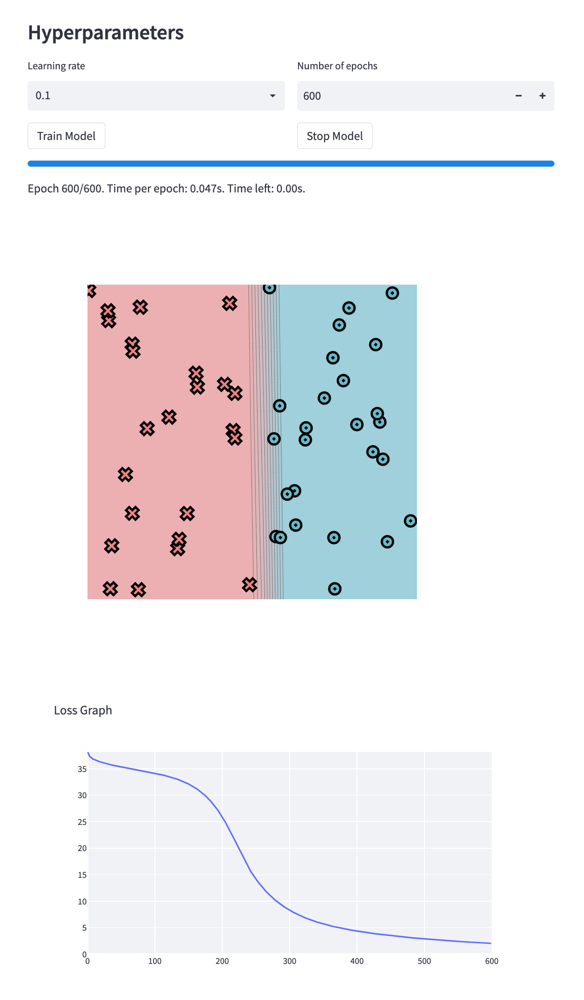
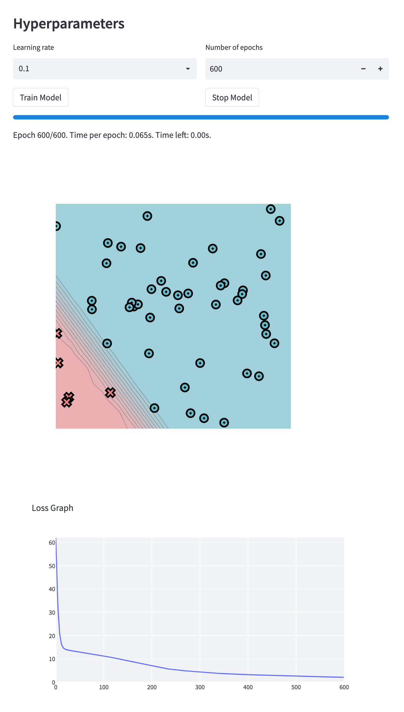
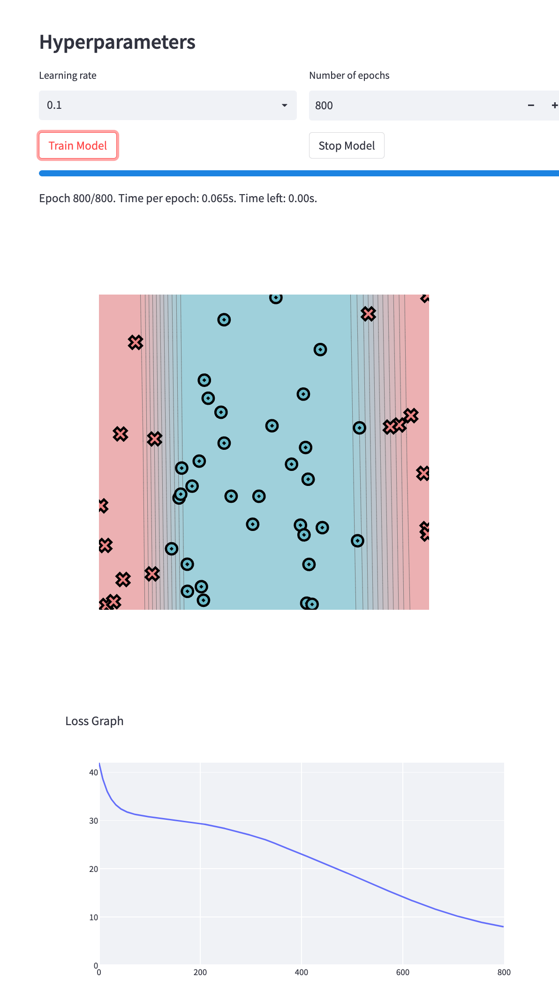
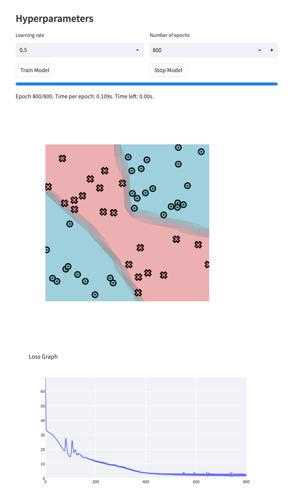

[](https://classroom.github.com/a/7COonC5j)
# MiniTorch Module 1


* Docs: https://minitorch.github.io/

* Overview: https://minitorch.github.io/module1/module1/

This assignment requires the following files from the previous assignments. You can get these by running

```bash
python sync_previous_module.py previous-module-dir current-module-dir
```

The files that will be synced are:

        minitorch/operators.py minitorch/module.py tests/test_module.py tests/test_operators.py project/run_manual.py

# Task 5: Training

## Simple:
Time per epoch: 0.047s
### Parameters:
    PTS = 50
    HIDDEN = 3
    RATE = 0.1
    EPOCHS = 600
### Visualization:

### Records:
        Epoch: 0/600, loss: 0, correct: 0
        Epoch: 10/600, loss: 36.786921737585864, correct: 23
        Epoch: 20/600, loss: 36.28723247132856, correct: 26
        Epoch: 30/600, loss: 35.923384911614434, correct: 26
        Epoch: 40/600, loss: 35.6193453431368, correct: 26
        Epoch: 50/600, loss: 35.35392625557223, correct: 26
        Epoch: 60/600, loss: 35.11304419511935, correct: 26
        Epoch: 70/600, loss: 34.88534683787791, correct: 26
        Epoch: 80/600, loss: 34.6607996371918, correct: 26
        Epoch: 90/600, loss: 34.42970981390441, correct: 26
        Epoch: 100/600, loss: 34.18187967554746, correct: 26
        Epoch: 110/600, loss: 33.905761483011936, correct: 26
        Epoch: 120/600, loss: 33.587518087234265, correct: 26
        Epoch: 130/600, loss: 33.20990734429028, correct: 26
        Epoch: 140/600, loss: 32.750925719811306, correct: 29
        Epoch: 150/600, loss: 32.18219169661197, correct: 30
        Epoch: 160/600, loss: 31.467171203807744, correct: 32
        Epoch: 170/600, loss: 30.559649977149423, correct: 33
        Epoch: 180/600, loss: 29.40355752486554, correct: 39
        Epoch: 190/600, loss: 27.93671054286907, correct: 41
        Epoch: 200/600, loss: 26.103500147500462, correct: 43
        Epoch: 210/600, loss: 23.88822563316808, correct: 45
        Epoch: 220/600, loss: 21.389626565657085, correct: 45
        Epoch: 230/600, loss: 18.785140934779754, correct: 45
        Epoch: 240/600, loss: 16.329639196761867, correct: 48
        Epoch: 250/600, loss: 14.335636982236757, correct: 48
        Epoch: 260/600, loss: 12.699986571237744, correct: 50
        Epoch: 270/600, loss: 11.31135698033601, correct: 49
        Epoch: 280/600, loss: 10.152263448396683, correct: 49
        Epoch: 290/600, loss: 9.182362815878477, correct: 49
        Epoch: 300/600, loss: 8.366886164704212, correct: 49
        Epoch: 310/600, loss: 7.6689964679870934, correct: 49
        Epoch: 320/600, loss: 7.071762648492856, correct: 49
        Epoch: 330/600, loss: 6.556951265034569, correct: 49
        Epoch: 340/600, loss: 6.114227969949329, correct: 49
        Epoch: 350/600, loss: 5.7315211358612155, correct: 49
        Epoch: 360/600, loss: 5.393797288093248, correct: 49
        Epoch: 370/600, loss: 5.093411544888239, correct: 49
        Epoch: 380/600, loss: 4.825149202460641, correct: 49
        Epoch: 390/600, loss: 4.585335123742098, correct: 49
        Epoch: 400/600, loss: 4.366758739292967, correct: 49
        Epoch: 410/600, loss: 4.166092493057559, correct: 50
        Epoch: 420/600, loss: 3.9808077383488976, correct: 50
        Epoch: 430/600, loss: 3.8088860302054153, correct: 50
        Epoch: 440/600, loss: 3.649706808077479, correct: 50
        Epoch: 450/600, loss: 3.5007032583084716, correct: 50
        Epoch: 460/600, loss: 3.360775563774369, correct: 50
        Epoch: 470/600, loss: 3.22917421156213, correct: 50
        Epoch: 480/600, loss: 3.1058727616946697, correct: 50
        Epoch: 490/600, loss: 2.990005608004355, correct: 50
        Epoch: 500/600, loss: 2.8800430074171492, correct: 50
        Epoch: 510/600, loss: 2.7755678028005626, correct: 50
        Epoch: 520/600, loss: 2.6762172431546563, correct: 50
        Epoch: 530/600, loss: 2.581667672769595, correct: 50
        Epoch: 540/600, loss: 2.491626858919289, correct: 50
        Epoch: 550/600, loss: 2.4058283976903927, correct: 50
        Epoch: 560/600, loss: 2.3240275975585676, correct: 50
        Epoch: 570/600, loss: 2.2462770922735045, correct: 50
        Epoch: 580/600, loss: 2.17217816874434, correct: 50
        Epoch: 590/600, loss: 2.1013740763269313, correct: 50
        Epoch: 600/600, loss: 2.033693781563555, correct: 50

## Diag
Time per epoch: 0.065s.
### Parameters"
    PTS = 50
    HIDDEN = 4
    RATE = 0.1
    Epochs = 600
### Visualizations

### Records
        Epoch: 10/600, loss: 19.533705275050497, correct: 45
        Epoch: 20/600, loss: 14.240393415070239, correct: 45
        Epoch: 30/600, loss: 13.66939086821009, correct: 45
        Epoch: 40/600, loss: 13.336180042854169, correct: 45
        Epoch: 50/600, loss: 13.015828400895504, correct: 45
        Epoch: 60/600, loss: 12.691856394410392, correct: 45
        Epoch: 70/600, loss: 12.36099456899636, correct: 45
        Epoch: 80/600, loss: 12.021138354516914, correct: 45
        Epoch: 90/600, loss: 11.670530861840955, correct: 45
        Epoch: 100/600, loss: 11.307731862820335, correct: 45
        Epoch: 110/600, loss: 10.931668841849083, correct: 45
        Epoch: 120/600, loss: 10.541719477336981, correct: 45
        Epoch: 130/600, loss: 10.137816577003177, correct: 45
        Epoch: 140/600, loss: 9.72056377672859, correct: 45
        Epoch: 150/600, loss: 9.291342739592633, correct: 45
        Epoch: 160/600, loss: 8.85238464879649, correct: 45
        Epoch: 170/600, loss: 8.40677427551471, correct: 45
        Epoch: 180/600, loss: 7.958358628780806, correct: 45
        Epoch: 190/600, loss: 7.511547740371101, correct: 46
        Epoch: 200/600, loss: 7.071021256450126, correct: 47
        Epoch: 210/600, loss: 6.641382959442953, correct: 47
        Epoch: 220/600, loss: 6.226823528052005, correct: 47
        Epoch: 230/600, loss: 5.853933293956837, correct: 47
        Epoch: 240/600, loss: 5.560203854016939, correct: 48
        Epoch: 250/600, loss: 5.301385320278378, correct: 48
        Epoch: 260/600, loss: 5.096347223717914, correct: 48
        Epoch: 270/600, loss: 4.90297553677162, correct: 48
        Epoch: 280/600, loss: 4.717251023479281, correct: 48
        Epoch: 290/600, loss: 4.539251441874589, correct: 48
        Epoch: 300/600, loss: 4.369138386319763, correct: 48
        Epoch: 310/600, loss: 4.206972666295567, correct: 48
        Epoch: 320/600, loss: 4.052718862259943, correct: 48
        Epoch: 330/600, loss: 3.912316393885237, correct: 48
        Epoch: 340/600, loss: 3.7936806437185076, correct: 48
        Epoch: 350/600, loss: 3.6919522998367866, correct: 48
        Epoch: 360/600, loss: 3.598554387911773, correct: 48
        Epoch: 370/600, loss: 3.5089753106937565, correct: 49
        Epoch: 380/600, loss: 3.422626844995779, correct: 49
        Epoch: 390/600, loss: 3.339372583719993, correct: 49
        Epoch: 400/600, loss: 3.259102740129725, correct: 49
        Epoch: 410/600, loss: 3.181709269513435, correct: 49
        Epoch: 420/600, loss: 3.10708513197629, correct: 49
        Epoch: 430/600, loss: 3.0351246876388807, correct: 50
        Epoch: 440/600, loss: 2.965724065397393, correct: 50
        Epoch: 450/600, loss: 2.898781493054202, correct: 50
        Epoch: 460/600, loss: 2.8341975927051664, correct: 50
        Epoch: 470/600, loss: 2.77187563697022, correct: 50
        Epoch: 480/600, loss: 2.7117217620268845, correct: 50
        Epoch: 490/600, loss: 2.65364513591058, correct: 50
        Epoch: 500/600, loss: 2.597558082889539, correct: 50
        Epoch: 510/600, loss: 2.5433761664497454, correct: 50
        Epoch: 520/600, loss: 2.491018234548228, correct: 50
        Epoch: 530/600, loss: 2.440406431421522, correct: 50
        Epoch: 540/600, loss: 2.3914661804875874, correct: 50
        Epoch: 550/600, loss: 2.3441632725201473, correct: 50
        Epoch: 560/600, loss: 2.298421807324552, correct: 50
        Epoch: 570/600, loss: 2.254140982193161, correct: 50
        Epoch: 580/600, loss: 2.2112593633891593, correct: 50
        Epoch: 590/600, loss: 2.169718357345552, correct: 50
        Epoch: 600/600, loss: 2.1294621120107635, correct: 50

## Split
Time per epoch: 0.065s.
### Parameters
    PTS = 50
    HIDDEN = 4
    LEARNING RATE = 0.1
    EPOCHS = 800
### Visualizations:

### Records:
        Epoch: 10/800, loss: 38.159280757796864, correct: 17
        Epoch: 20/800, loss: 35.448909218907055, correct: 17
        Epoch: 30/800, loss: 33.77816213761954, correct: 36
        Epoch: 40/800, loss: 32.73938822659129, correct: 38
        Epoch: 50/800, loss: 32.07823506352715, correct: 34
        Epoch: 60/800, loss: 31.64196385830156, correct: 34
        Epoch: 70/800, loss: 31.340400571931667, correct: 33
        Epoch: 80/800, loss: 31.106702239217448, correct: 33
        Epoch: 90/800, loss: 30.931232043895957, correct: 33
        Epoch: 100/800, loss: 30.78592819912426, correct: 33
        Epoch: 110/800, loss: 30.65403985184017, correct: 33
        Epoch: 120/800, loss: 30.53247292474266, correct: 33
        Epoch: 130/800, loss: 30.413530342088375, correct: 33
        Epoch: 140/800, loss: 30.292902700457937, correct: 33
        Epoch: 150/800, loss: 30.16835286511218, correct: 34
        Epoch: 160/800, loss: 30.039095308159627, correct: 34
        Epoch: 170/800, loss: 29.905519905886617, correct: 34
        Epoch: 180/800, loss: 29.74751446672068, correct: 34
        Epoch: 190/800, loss: 29.56997189307949, correct: 34
        Epoch: 200/800, loss: 29.39912740831745, correct: 34
        Epoch: 210/800, loss: 29.22329314595189, correct: 34
        Epoch: 220/800, loss: 29.032314826319936, correct: 36
        Epoch: 230/800, loss: 28.8232882602425, correct: 38
        Epoch: 240/800, loss: 28.59333813960555, correct: 39
        Epoch: 250/800, loss: 28.34448928860615, correct: 40
        Epoch: 260/800, loss: 28.065273214490826, correct: 41
        Epoch: 270/800, loss: 27.80981686141832, correct: 41
        Epoch: 280/800, loss: 27.551409961111386, correct: 41
        Epoch: 290/800, loss: 27.266939469954757, correct: 41
        Epoch: 300/800, loss: 26.980258612816932, correct: 41
        Epoch: 310/800, loss: 26.697055792838544, correct: 41
        Epoch: 320/800, loss: 26.364791741012194, correct: 41
        Epoch: 330/800, loss: 26.01909104528564, correct: 41
        Epoch: 340/800, loss: 25.611437697734477, correct: 41
        Epoch: 350/800, loss: 25.213890639526543, correct: 41
        Epoch: 360/800, loss: 24.81938753825691, correct: 41
        Epoch: 370/800, loss: 24.36168465205089, correct: 41
        Epoch: 380/800, loss: 23.90063942062515, correct: 41
        Epoch: 390/800, loss: 23.452312573677144, correct: 41
        Epoch: 400/800, loss: 23.049206707572893, correct: 41
        Epoch: 410/800, loss: 22.64454943350065, correct: 41
        Epoch: 420/800, loss: 22.233208635299512, correct: 41
        Epoch: 430/800, loss: 21.81746127460666, correct: 41
        Epoch: 440/800, loss: 21.395849355628606, correct: 40
        Epoch: 450/800, loss: 20.963726134561956, correct: 40
        Epoch: 460/800, loss: 20.526174745567257, correct: 40
        Epoch: 470/800, loss: 20.076635514384414, correct: 40
        Epoch: 480/800, loss: 19.62030922007318, correct: 40
        Epoch: 490/800, loss: 19.15961151248921, correct: 45
        Epoch: 500/800, loss: 18.69736424223286, correct: 45
        Epoch: 510/800, loss: 18.237353543565742, correct: 45
        Epoch: 520/800, loss: 17.774957267196665, correct: 45
        Epoch: 530/800, loss: 17.318132463220934, correct: 46
        Epoch: 540/800, loss: 16.868251986938095, correct: 47
        Epoch: 550/800, loss: 16.419198416491497, correct: 47
        Epoch: 560/800, loss: 15.970707772684982, correct: 47
        Epoch: 570/800, loss: 15.523272003397402, correct: 47
        Epoch: 580/800, loss: 15.080879915216697, correct: 48
        Epoch: 590/800, loss: 14.645414040126608, correct: 48
        Epoch: 600/800, loss: 14.215618609870742, correct: 48
        Epoch: 610/800, loss: 13.791645307905874, correct: 48
        Epoch: 620/800, loss: 13.37629781219217, correct: 49
        Epoch: 630/800, loss: 12.971026218380194, correct: 49
        Epoch: 640/800, loss: 12.57619248633479, correct: 49
        Epoch: 650/800, loss: 12.191765307546927, correct: 49
        Epoch: 660/800, loss: 11.818608513937598, correct: 49
        Epoch: 670/800, loss: 11.45825201299744, correct: 49
        Epoch: 680/800, loss: 11.11242060168696, correct: 49
        Epoch: 690/800, loss: 10.7788480113703, correct: 49
        Epoch: 700/800, loss: 10.456714413594057, correct: 49
        Epoch: 710/800, loss: 10.148407987691984, correct: 49
        Epoch: 720/800, loss: 9.85325339789678, correct: 49
        Epoch: 730/800, loss: 9.57110251340852, correct: 49
        Epoch: 740/800, loss: 9.308450981901293, correct: 50
        Epoch: 750/800, loss: 9.058951155227268, correct: 50
        Epoch: 760/800, loss: 8.819658810735536, correct: 50
        Epoch: 770/800, loss: 8.595040364087236, correct: 50
        Epoch: 780/800, loss: 8.383144843320112, correct: 50
        Epoch: 790/800, loss: 8.182135191266415, correct: 50
        Epoch: 800/800, loss: 7.9900371053716865, correct: 50

## XOR
Time per epoch: 0.109s.
### Parameters
    PTS = 50
    HIDDEN = 6
    LEARNING RATE = 0.5
    EPOCHS = 800
### Visualization

### Records
        Epoch: 10/800, loss: 32.29949422517297, correct: 29
        Epoch: 20/800, loss: 31.215947918101516, correct: 29
        Epoch: 30/800, loss: 29.835743936276437, correct: 29
        Epoch: 40/800, loss: 28.02155207840872, correct: 40
        Epoch: 50/800, loss: 25.701040961698414, correct: 44
        Epoch: 60/800, loss: 22.99711278171713, correct: 43
        Epoch: 70/800, loss: 20.227976273552528, correct: 43
        Epoch: 80/800, loss: 22.71861324590036, correct: 35
        Epoch: 90/800, loss: 17.39094840356826, correct: 45
        Epoch: 100/800, loss: 14.906676295635279, correct: 46
        Epoch: 110/800, loss: 22.02889162301, correct: 36
        Epoch: 120/800, loss: 19.38225706187765, correct: 41
        Epoch: 130/800, loss: 16.539010512394675, correct: 43
        Epoch: 140/800, loss: 16.17661595320811, correct: 44
        Epoch: 150/800, loss: 14.519292754457325, correct: 44
        Epoch: 160/800, loss: 14.139724103132439, correct: 45
        Epoch: 170/800, loss: 13.306844016797037, correct: 45
        Epoch: 180/800, loss: 12.726757428453636, correct: 45
        Epoch: 190/800, loss: 12.201448435690464, correct: 45
        Epoch: 200/800, loss: 11.456182440039912, correct: 45
        Epoch: 210/800, loss: 10.968615952930076, correct: 45
        Epoch: 220/800, loss: 10.611578801260803, correct: 45
        Epoch: 230/800, loss: 10.1393204344284, correct: 45
        Epoch: 240/800, loss: 9.725921701781406, correct: 45
        Epoch: 250/800, loss: 9.32875998341023, correct: 45
        Epoch: 260/800, loss: 8.950257006833338, correct: 45
        Epoch: 270/800, loss: 8.700479562598364, correct: 45
        Epoch: 280/800, loss: 8.431386167073372, correct: 45
        Epoch: 290/800, loss: 7.818816893567001, correct: 46
        Epoch: 300/800, loss: 7.429088029349825, correct: 47
        Epoch: 310/800, loss: 7.138555413370131, correct: 47
        Epoch: 320/800, loss: 6.618159635151138, correct: 48
        Epoch: 330/800, loss: 6.014936526190467, correct: 48
        Epoch: 340/800, loss: 5.570890502513264, correct: 49
        Epoch: 350/800, loss: 5.1046572458522235, correct: 49
        Epoch: 360/800, loss: 4.657698740289088, correct: 49
        Epoch: 370/800, loss: 4.281753436346307, correct: 49
        Epoch: 380/800, loss: 3.864601874488897, correct: 49
        Epoch: 390/800, loss: 3.5983901850696514, correct: 49
        Epoch: 400/800, loss: 3.389990603821109, correct: 49
        Epoch: 410/800, loss: 3.149216581761838, correct: 49
        Epoch: 420/800, loss: 3.0091373883786887, correct: 50
        Epoch: 430/800, loss: 2.8682896386278007, correct: 50
        Epoch: 440/800, loss: 2.7254403499685904, correct: 50
        Epoch: 450/800, loss: 2.616599014455752, correct: 50
        Epoch: 460/800, loss: 2.5164973156441013, correct: 50
        Epoch: 470/800, loss: 2.4310675482476776, correct: 50
        Epoch: 480/800, loss: 2.346134269966821, correct: 50
        Epoch: 490/800, loss: 2.304862191266229, correct: 50
        Epoch: 500/800, loss: 2.223869164543311, correct: 50
        Epoch: 510/800, loss: 2.1624193227199964, correct: 50
        Epoch: 520/800, loss: 2.106863944684386, correct: 50
        Epoch: 530/800, loss: 2.0561778139291125, correct: 50
        Epoch: 540/800, loss: 2.0100058711178095, correct: 50
        Epoch: 550/800, loss: 1.9623787591507513, correct: 50
        Epoch: 560/800, loss: 1.930258545516557, correct: 50
        Epoch: 570/800, loss: 1.894595378546751, correct: 50
        Epoch: 580/800, loss: 1.8607093794554364, correct: 50
        Epoch: 590/800, loss: 1.830158660176231, correct: 50
        Epoch: 600/800, loss: 1.806028756924987, correct: 50
        Epoch: 610/800, loss: 1.7739522169458442, correct: 50
        Epoch: 620/800, loss: 1.7474964163561741, correct: 50
        Epoch: 630/800, loss: 1.7254334584063162, correct: 50
        Epoch: 640/800, loss: 1.7026990294899542, correct: 50
        Epoch: 650/800, loss: 1.5398514732781534, correct: 50
        Epoch: 660/800, loss: 1.6616872263380447, correct: 50
        Epoch: 670/800, loss: 1.6424100997221165, correct: 50
        Epoch: 680/800, loss: 1.6260285581294076, correct: 50
        Epoch: 690/800, loss: 1.600122750044167, correct: 50
        Epoch: 700/800, loss: 1.5970649951057452, correct: 50
        Epoch: 710/800, loss: 1.569140659406843, correct: 50
        Epoch: 720/800, loss: 1.5721194759766257, correct: 50
        Epoch: 730/800, loss: 1.5320055648462598, correct: 50
        Epoch: 740/800, loss: 1.3695578137408642, correct: 50
        Epoch: 750/800, loss: 1.5189795169824358, correct: 50
        Epoch: 760/800, loss: 1.5482116319484849, correct: 50
        Epoch: 770/800, loss: 1.4258436307236182, correct: 50
        Epoch: 780/800, loss: 1.553428501993174, correct: 50
        Epoch: 790/800, loss: 1.5013671161814295, correct: 50
        Epoch: 800/800, loss: 1.4365862980731352, correct: 50